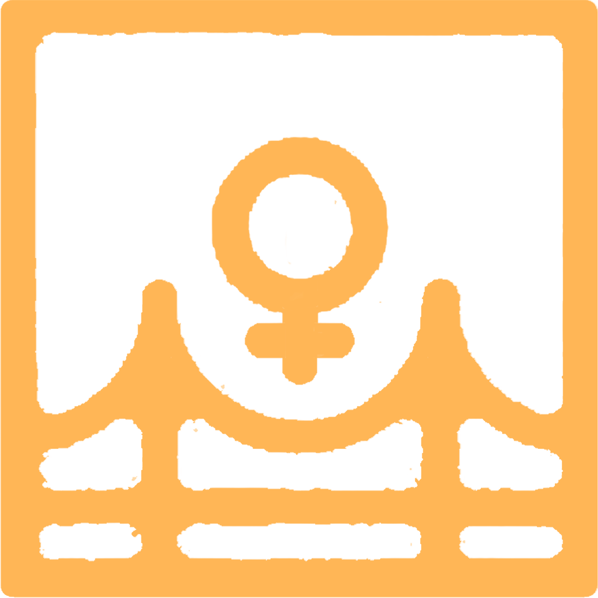

<div style="text-align:center">
    
    <h1 style="color:orange"> Tulay Kahel Project </h1>
    <i> Building bridges towards a VAW-Free Workplace" </i>
</div>
<br>

[Access Project Repository](https://github.com/Tulay-Kahel/Tulay-Kahel-Project)

<h2 style="color:orange"> About </h2>

Tulay Kahel (orange bridge 🍊🌉, a pun on <b style="color:orange">“kulay kahel”</b> and the fact that the company/employer (via the webapp) serves more like a bridge between the VAW-affected individuals/survivors and VAWC partners.

ℹ A web-based application that enables and equips the private sector to set up their own VAW Reporting (Virtual) Desk to receive reports and assist their VAW-affected employees.

<h2 style="color:orange"> Features </h2>

✅ VAW Case Reporting for affected employees

✅ Registration and Certification System to be a VAW Partner

✅ EVAW Toolkit for Private Sector (Guides, Readings, directory of VAW Desks and EVAWC Organizations and Volunteers)

✅ Dedicated Assistance in cases of bias, conflict-of-interest

✅VAW Case Reports Management Suite for Companies/Employers

<h2 style="color:orange"> How Can Tulay Kahel Help? </h2>

### For Employees

✅ Remotely and Securely Report VAW Cases (via company-supplied report link)

✅ Get timely updates

✅ Be assisted and referred to EVAW partners

### For Companies/Employers

✅ Register and get Certified as EVAW Partner Manage VAW Reports

✅ Get access to VAW for private sector toolkits

✅ Ensure employee well-being

### For VAW Desks, EVAW Organizations, and Volunteers

✅ Become more accessible and widen their reach

✅ Share knowledge and expertise to the private sector


<h2 style="color:orange"> Project Befits </h2>

### Immediate Benefits

🍊 Encourage employees to report (either in person or via the webapp) as they’ll be aware that the company assists VAW-affected individuals/survivors 

🍊 Enable companies/employers to assist and help report VAWC cases among their employees

🍊 Enable employee well-being

🍊 Improve company/employer publicity and reputation

### Secondary Benefits

🍊 Raise awareness on VAWC, and that employers also have a role in ending VAWC

🍊 Raise awareness and becoming an extension of Anti-VAWC partners (e.g. IACVAWC, 
UPV GAD, UGSAD)

<h2 style="color:orange"> Running the Project (Development and Testing) </h2>

### Prerequisites (Backend)
- Python 3.6+, preferably 3.11
- Docker Compose
- MongoDB Compass (optional)
### Python Libraries
- FastAPI
- mongoengine
- uvicorn
### Setup (Backend)
- Clone the repository
- Activate the MongoDB Container

Note: Make sure that you are in the root directory where the docker-compose.yml file is located
```bash
cd ./TK_API_DB
```

Use Docker Compose to build the container
```bash
docker-compose build
```

```bash
docker-compose up
```

You can use MongoDB Compass to connect, view, and edit the database

- Run the API

Note: Make sure that you are in the root directory where the tulay_kahel_api.py file is located

```bash
cd ./TK_API_DB
```

Run the API server using Python
```bash
python3 tulay_kahel_api.py
```

### Prequisites (Frontend)
- Flutter (latest stable version as of December 2022)
- You may chheck the FrontEnd Design using this [link](https://qrco.de/bdZ586)
### Flutter Libraries
- Material Design
- Google Fonts
### Setup (Frontend)
- Clone the repository
- cd into the frontend directory (where main.dart is located)

```bash
cd ./TK_webApp/tk_webapp/lib
```

- Run the app using Flutter

```bash
flutter run
```

<h2 style="color:orange"> The Team </h2>

- Product Manager: [Nikko Gabriel J. Hismaña](https://github.com/nikko-gabriel) 
- Lead Developer: [John Markton M. Olarte](https://github.com/GravitonXD)
- Lead Designer (UI/UX): [Erru G. Torculas](mailto:egtorculas@up.edu.ph)